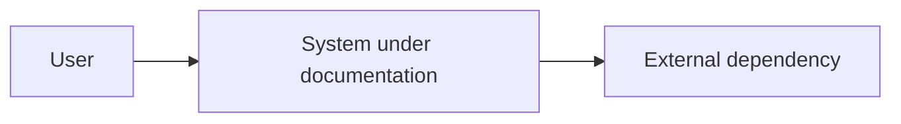
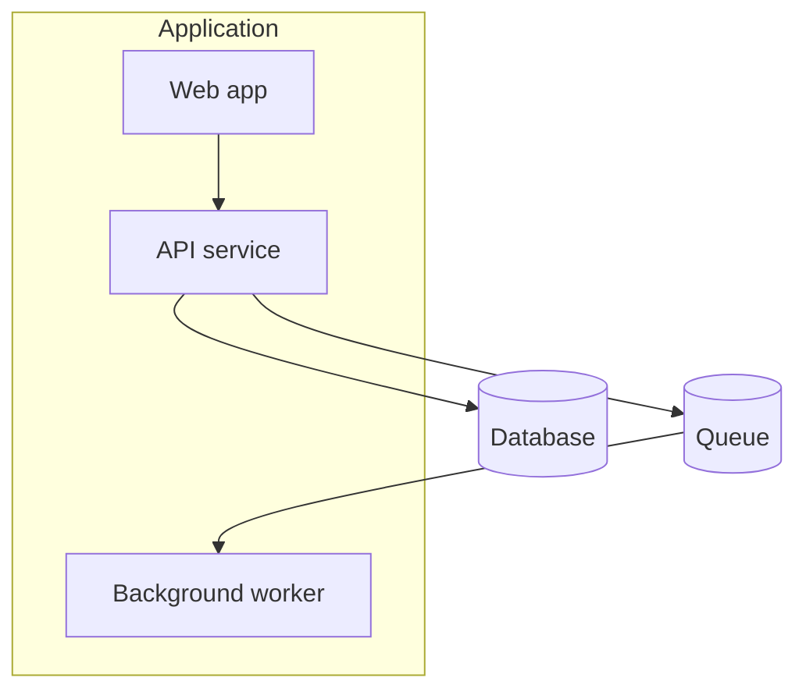
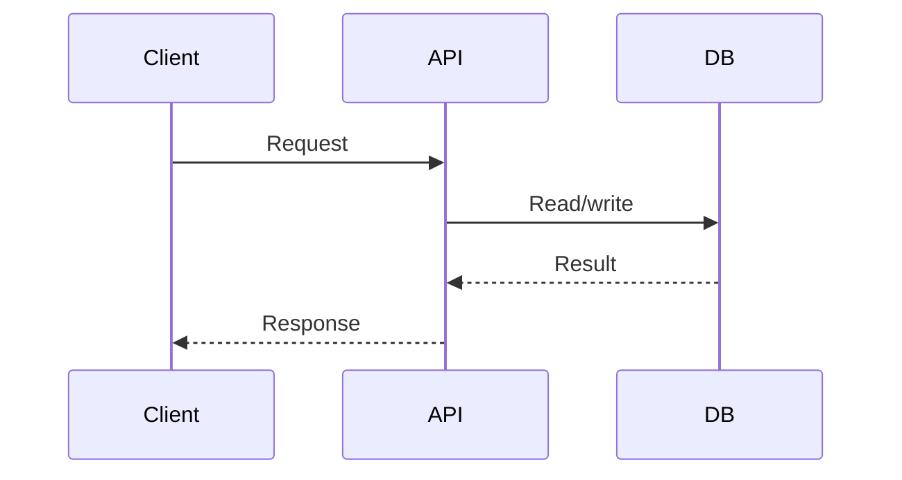
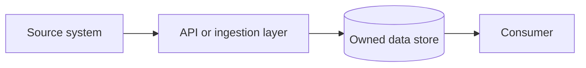
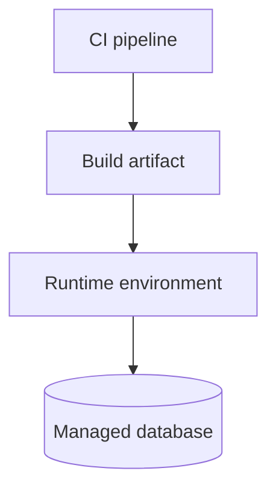

# Diagram Patterns

Prefer Mermaid because it is reviewable, diffable, and supported by GitHub.

Treat diagrams as a default documentation artifact. If the repository has real runtime behavior, external dependencies, persistence, queues, APIs, jobs, or deployment config, create diagrams. Only skip diagrams for tiny libraries or repositories where a diagram would add no clarity.

## Default Diagram Set

For a non-trivial app or service, create:

- `context.mmd`: users, system boundary, external systems.
- `container-or-flow.mmd`: main runtime parts, storage, queues, workers, frontends, APIs.
- `critical-sequence.mmd`: the most important request, command, job, or event flow.
- `data-flow.mmd`: data ownership and movement when persistence or integrations exist.
- `deployment.mmd`: runtime topology when infrastructure/config is visible.

If only one diagram fits, choose the one that explains the system fastest to a new engineer.

## Selection Guide

Use a context diagram when:
- the reader needs to understand users, external systems, and system boundaries
- the repo is one service inside a larger landscape

Use a container diagram when:
- the repo has multiple deployable units, processes, databases, queues, or frontend/backend parts

Use a component diagram when:
- one deployable unit has important internal modules that matter for changes

Use a sequence diagram when:
- one important request, event, or job spans multiple components

Use a data-flow diagram when:
- data ownership, transformation, replication, or privacy boundaries matter

Use a deployment diagram when:
- runtime infrastructure, regions, networking, jobs, or managed services matter

## Behavior Diagrams

Always look for at least one useful behavior diagram:

- HTTP request -> auth -> handler -> database -> response
- event publish -> queue/topic -> consumer -> side effect
- scheduled job -> read -> transform -> write/upload
- frontend action -> API -> external dependency
- deploy pipeline -> build -> test -> release

If the code has no obvious primary flow, document that as `Unknown` rather than inventing one.

## Mermaid Defaults

### Context

### Container

### Sequence

### Data Flow

### Deployment

## Rules

- Keep node names human-readable.
- Prefer verbs on edges: `publishes`, `validates`, `reads`, `writes`, `calls`, `renders`.
- Keep diagrams under 10 nodes unless the structure is genuinely simple.
- Split diagrams by concern rather than making one large unreadable map.
- Put Mermaid in fenced blocks or `.mmd` files.
- Validate diagrams in CI when the repo already has a Mermaid renderer or markdown linter.
- Do not put secrets, hostnames, customer names, or private environment values in diagrams unless already public and appropriate.
